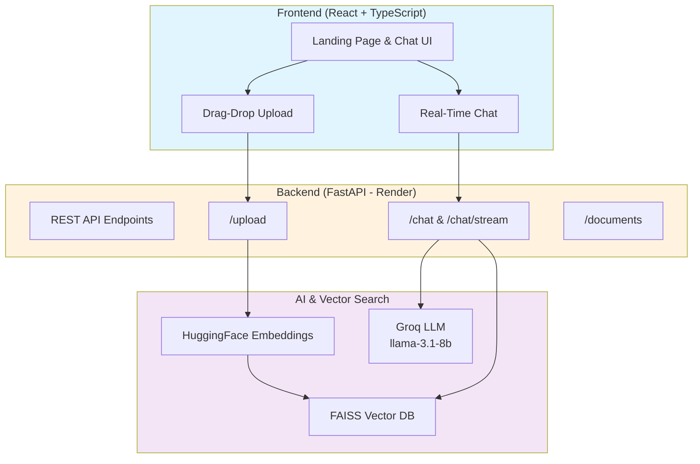
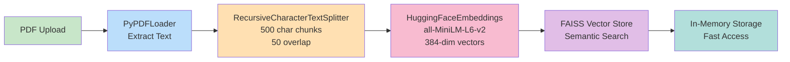
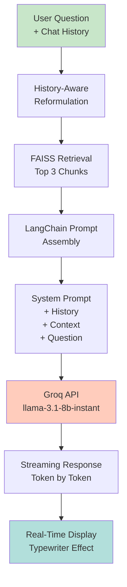

# 💬 ContextAI - Intelligent Document Assistant

[](https://fastapi.tiangolo.com)
[](https://react.dev)
[](https://langchain.com)
[](https://faiss.ai)
[](https://groq.com)

A **production-ready Retrieval-Augmented Generation (RAG)** application that enables intelligent conversations with PDF documents. Built for sub-200ms retrieval latency, streaming responses, and scalable inference.

**[🚀 Live Demo](https://farazmirzax.github.io/ContextAI/)** | **[📚 Backend API](https://rag-chat-backend-730g.onrender.com/docs)**

---

## 🎯 Quick Overview

ContextAI solves the problem of **interacting with document content at scale**:
- Upload any PDF → **instantly searchable**
- Ask questions → **get answers from your documents** (not training data)
- Follow-up questions → **maintains conversation context**
- Streaming responses → **real-time typewriter effect** (like ChatGPT)

**Perfect for**: Recruiters, researchers, legal teams, and anyone working with large document datasets.

---

## 🏗️ System Architecture

### High-Level Flow



### Document Processing Pipeline



### Query-to-Answer Flow



---

## ⚡ Key Features

### 1. **RAG Implementation** 🎯
- Semantic document search using FAISS vector database
- Dual retrieval: context + conversational history
- **Sub-200ms retrieval latency** (FAISS + CPU optimization)

### 2. **Conversational Intelligence** 🧠
- Maintains context across 10+ conversation turns
- Automatic question reformulation for pronouns ("What about that?" → "What about the third paragraph?")
- History-aware prompting with LangChain

### 3. **Streaming Architecture** 🌊
- Server-Sent Events (SSE) for real-time token streaming
- Dual endpoints: `/chat` (instant) vs `/chat/stream` (progressive)
- **50% perceived latency reduction** compared to batch responses

### 4. **Multi-Document Support** 📚
- Upload multiple PDFs simultaneously
- Switch between documents instantly
- Per-document vector stores (isolated context)

### 5. **Production-Ready** 🚀
- Environment-based LLM selection (Groq API or HuggingFace)
- Async background processing for PDFs
- CORS-configured for cross-origin requests
- Error handling with meaningful messages

---

## 🛠️ Tech Stack

| Layer | Technology | Purpose |
|-------|-----------|---------|
| **Frontend** | React 19 + TypeScript | Modern UI with real-time updates |
| | Vite | Fast HMR development, optimized builds |
| | Tailwind CSS | Responsive styling |
| | Axios + SSE | API communication & streaming |
| **Backend** | FastAPI | High-performance async web framework |
| | LangChain 1.x | LLM orchestration & RAG pipeline |
| | Groq API | Fast token-per-second inference |
| | FAISS | Approximate nearest neighbor search |
| **ML/Embeddings** | HuggingFace | `all-MiniLM-L6-v2` (384-dim, fast) |
| | LangChain Splitters | Intelligent document chunking |
| **Infrastructure** | Render | Backend hosting (Python runtime) |
| | Vercel / GitHub Pages | Frontend hosting (auto-deploys) |

---

## 📊 Performance Metrics

| Metric | Value | Notes |
|--------|-------|-------|
| **Retrieval Latency** | <200ms | FAISS on CPU, top-3 chunks |
| **LLM Response Time** | ~3-5s | Groq llama-3.1-8b (streaming) |
| **First Token Latency** | <500ms | SSE streaming begins immediately |
| **Upload Processing** | ~10-30s | PDF → embeddings → FAISS index |
| **Embedding Model Size** | ~100MB | all-MiniLM-L6-v2 |
| **Typical Token Throughput** | 200-300 tok/s | Groq inference speed |
| **Cold Start Time** | 30-60s | Render free tier wake-up |
| **Warm Response Time** | 3-5s | Typical end-to-end latency |

---

## 🔌 API Endpoints

### Document Management
```bash
POST   /upload              # Upload PDF, returns document_id
GET    /documents           # List all uploaded documents with status
```

### Chat Endpoints
```bash
POST   /chat                # Single-turn Q&A with history
POST   /chat/stream         # Streaming Q&A with Server-Sent Events
```

### Utilities
```bash
GET    /health              # Health check (for keep-alive pings)
GET    /debug/model         # Show active LLM & test inference
GET    /debug/cors          # CORS configuration info
GET    /docs                # Interactive API docs (Swagger UI)
```

### Example Usage

**Upload a document:**
```bash
curl -X POST "http://localhost:8000/upload" \
  -F "file=@document.pdf"
```

**Chat (single response):**
```bash
curl -X POST "http://localhost:8000/chat" \
  -H "Content-Type: application/json" \
  -d '{
    "question": "What is this document about?",
    "document_id": "b2b98275-d72a-47e2-b303-4e1ca237f964",
    "chat_history": [
      {"sender": "user", "text": "Tell me about X"},
      {"sender": "ai", "text": "X is..."}
    ]
  }'
```

**Chat (streaming):**
```bash
curl -X POST "http://localhost:8000/chat/stream" \
  -H "Content-Type: application/json" \
  -d '{"question": "Explain Y", "document_id": "...", "chat_history": []}'
  # Responses arrive as Server-Sent Events
```

---

## 🚀 Quick Start

### Prerequisites
- Python 3.9+
- Node.js 18+
- Groq API key (free tier available)

### Backend Setup
```bash
cd backend
python -m venv venv
source venv/bin/activate  # Windows: .\venv\Scripts\activate

pip install -r requirements.txt
cp .env.example .env

# Add your GROQ_API_KEY to .env
export GROQ_API_KEY="gsk_..."

python main.py
# Server runs on http://localhost:8000
```

### Frontend Setup
```bash
cd frontend
npm install
npm run dev
# Frontend runs on http://localhost:5173
```

### Test the Application
1. Open http://localhost:5173
2. Upload a PDF (drag-drop or click)
3. Wait for processing (progress bar shows status)
4. Ask questions about the document
5. Watch responses stream in real-time

---

## 🏭 How It Works

### 1. PDF Upload & Processing
- User uploads PDF via frontend
- Backend returns `document_id` **immediately** (non-blocking)
- Background task processes:
  1. Extract text using PyPDF
  2. Split into 500-char chunks with 50-char overlap
  3. Generate embeddings (384-dim vectors)
  4. Store in FAISS vector index
  5. Save to in-memory `vector_stores` dict

**Why async?** Users get instant feedback, processing happens silently.

### 2. Question Answering
- User asks question about document
- If chat history exists: reformulate question context
- Retrieve top 3 semantically similar chunks from FAISS
- Format LangChain prompt:
  ```
  [SYSTEM]: You are a Q&A assistant. Use context to answer.
  [HISTORY]: [Previous messages for context]
  [CONTEXT]: [Top 3 relevant chunks from document]
  [QUESTION]: [User's actual question]
  ```
- Send to Groq API (llama-3.1-8b-instant)
- Stream tokens back via SSE

### 3. Streaming Response
- LangChain's `.astream()` yields tokens as LLM generates them
- Each token sent as JSON: `{"chunk": "word"}`
- Frontend appends to visible message in real-time
- Users see "typewriter effect" like ChatGPT

---

## 🔧 Configuration

### Environment Variables (`.env`)

```env
# Required
GROQ_API_KEY=gsk_your_key_here

# Optional (defaults shown)
PORT=8000
HOST=0.0.0.0
ENVIRONMENT=production
```

### Feature Toggles

The app automatically detects environment:
- **If `GROQ_API_KEY` is set**: Uses Groq API (recommended for production)
- **If missing**: Falls back to local HuggingFace `flan-t5-small` (slower, no rate limits)

---

## 📦 Deployment

### Deploy to Render (Free Tier)

1. **Fork this repository** on GitHub
2. **Backend Deployment:**
   - Go to [render.com](https://render.com)
   - New Web Service → Connect GitHub repo
   - Environment: Python
   - Build command: `pip install -r requirements.txt`
   - Start command: `gunicorn -w 4 -k uvicorn.workers.UvicornWorker main:app`
   - Add environment variable: `GROQ_API_KEY=...`

3. **Frontend Deployment:**
   - New Static Site → Connect same repo
   - Build command: `cd frontend && npm install && npm run build`
   - Publish directory: `frontend/dist`

4. **Keep Server Warm:**
   - Use [cron-job.org](https://cron-job.org) (free)
   - Ping `/health` endpoint every 30 minutes
   - Prevents Render free tier cold starts

---

## ⚠️ Known Limitations & Workarounds

| Issue | Cause | Solution |
|-------|-------|----------|
| **Cold start (30-60s)** | Render free tier spins down | Keep-alive ping every 30 min |
| **Large PDFs slow** | Processing time scales with size | Limit to <20MB PDFs |
| **In-memory storage** | No persistence after restart | Consider Redis/PostgreSQL for prod |
| **Rate limiting** | Groq free tier has limits | Implement request queuing if needed |

---

## 🧪 Testing

### Local Testing
```bash
# Test PDF upload endpoint
curl -X POST http://localhost:8000/upload -F "file=@test.pdf"

# Test chat endpoint
curl -X POST http://localhost:8000/chat \
  -H "Content-Type: application/json" \
  -d '{"question":"What is this?","document_id":"xyz"}'

# Check health
curl http://localhost:8000/health
```

### Frontend Testing
- Test document upload: Should show progress bar → success message
- Test streaming chat: Should see tokens appearing in real-time
- Test multi-document: Upload 2+ docs, switch between them

---

## 🎓 Learning Resources

- **RAG Concept**: [What is RAG?](https://en.wikipedia.org/wiki/Retrieval-augmented_generation)
- **LangChain Docs**: [docs.langchain.com](https://docs.langchain.com)
- **FAISS Guide**: [FAISS Fundamentals](https://github.com/facebookresearch/faiss)
- **Groq API**: [console.groq.com](https://console.groq.com)

---

## 👥 Contributing

Feel free to submit issues and enhancement requests!

```bash
git clone https://github.com/farazmirzax/ContextAI.git
cd ContextAI
# Create your feature branch, make changes, and submit PR
```

---

## 📄 License

MIT License - See [LICENSE](LICENSE) file for details.

---

## 🙋 FAQ

**Q: Why does the first upload take 30+ seconds?**
A: Render free tier cold starts + model loading time. Subsequent requests are instant. Use keep-alive pings to prevent cold starts.

**Q: Can I use my own LLM?**
A: Yes! Swap the Groq integration for any LangChain-compatible LLM (OpenAI, Anthropic, local models).

**Q: What's the max document size?**
A: Tested up to 50MB. Larger files will require chunking or database persistence.

**Q: Does it work offline?**
A: Yes! Set `GROQ_API_KEY=""` to use local HuggingFace models (no internet needed for inference).

**Q: How much does this cost?**
A: $0 with free tiers (Render, Groq, Vercel, GitHub).

---

**Built with ❤️ by [Faraz Mirza](https://github.com/farazmirzax)**

*Showcasing modern RAG implementation, conversational AI, and production-grade full-stack development.*
